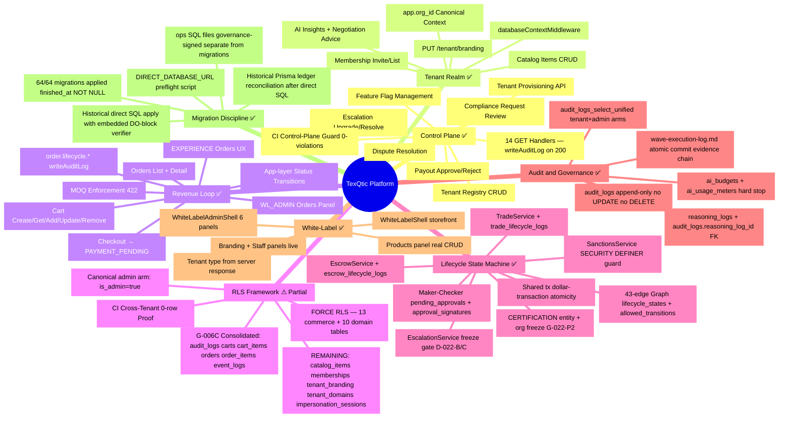
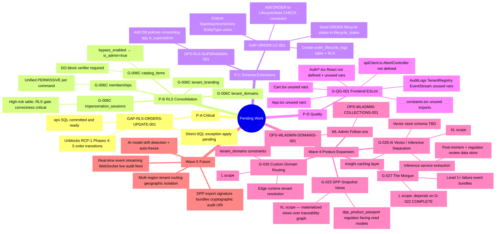

> STATUS — RETAINED AS REFERENCE WITH TARGETED DE-AUTHORIZATION
>
> This master plan is preserved as historical planning and implementation context.
>
> It is no longer the active authority for:
> - current product-truth definition
> - execution sequencing
> - next-delivery prioritization
>
> Current replacement authority for those concerns is:
> - Layer 0 posture in `governance/control/OPEN-SET.md` and `governance/control/NEXT-ACTION.md`
> - `docs/product-truth/TEXQTIC-NEXT-DELIVERY-PLAN-v2.md`
> - `docs/product-truth/TEXQTIC-GAP-REGISTER-v2.md`
> - `docs/product-truth/TEXQTIC-IMPLEMENTATION-ROADMAP-v2.md`
> - `docs/product-truth/TEXQTIC-LAUNCH-FAMILY-CHAIN-BASELINE-AND-SEQUENCING-FRICTION-v1.md`
> - the current reconciliation layer in `docs/product-truth/`
>
> This banner de-authorizes sequencing use and corrects stale replacement pointers without removing
> the document's historical record value.

# Texqtic Implementation Master Plan — 2026-03

**TECS:** OPS-IMPLEMENTATION-PLAN-AUDIT-001  
**Date Produced:** 2026-03-03  
**Doctrine Version:** v1.4  
**Source Files:** `governance/gap-register.md` · `governance/wave-execution-log.md` · `governance/coverage-matrix.md` · `docs/ops/REMOTE-MIGRATION-APPLY-LOG.md`  
**DB Alignment Timestamp:** GOVERNANCE-SYNC-048 · 64/64 migrations applied · `Database schema is up to date!`

---

## Table of Contents

1. [Historical Execution Synthesis](#1-historical-execution-synthesis)
2. [Current Capability Matrix](#2-current-capability-matrix)
3. [Remaining Gaps — Structured Classification](#3-remaining-gaps--structured-classification)
4. [Dependency Graph](#4-dependency-graph)
5. [Risk Assessment](#5-risk-assessment)
6. [90-Day Roadmap](#6-90-day-roadmap)
7. [Mermaid Mind Maps](#7-mermaid-mind-maps)

---

## 1. Historical Execution Synthesis

### 1.1 Structured Wave Table — Implemented Gaps by Wave

| Wave | Domain | Gap IDs | What Was Achieved | Dependencies Resolved |
|------|--------|---------|-------------------|-----------------------|
| Wave 1 (Bootstrap) | DB Roles + Schema | `20260206…20260215` migrations (14 migrations) | Init schema, event_logs, marketplace/cart/catalog spine, marketplace_cart_summary projection, DB role bootstrap (`texqtic_app`, `app_user`), unique token hash, hardening gates A–D7 (context helpers, FORCE RLS catalog_items, RESTRICTIVE guard, RLS-enforced app role creation, memberships/invites, carts/cart_items, audit_logs/event_logs, white_label_config, AI governance, marketplace_cart_summaries, impersonation_sessions, hotfix tenant grants) | None — foundation layer |
| Wave 2 (Stabilization) | RLS + Middleware | G-001, G-002, G-003, G-004, G-005, G-005-BLOCKER, G-TENANTS-SELECT, G-006, G-006D, G-007, G-007B, G-007C, G-008, G-009, G-010, G-011, G-012, G-013, G-014, G-BCR-001 | Tenant context variable unified to `app.org_id`; FORCE RLS on all commerce tables; orders/order_items policies added; middleware canonicalized (`databaseContextMiddleware`); dual `withDbContext` removed; pooler bleed fix (`SET LOCAL` everywhere); provisioning endpoint; feature flag seeds; totals service; impersonation routes; email service; CI RLS cross-tenant proof; double-tx nesting fix; bcryptjs migration for Node compatibility | G-001 unlocked all subsequent RLS work |
| Wave 3 (Schema Buildout) | Domain Tables | G-015, G-016, G-017, G-018, G-019, G-020, G-021, G-022, G-023, G-024, GATE-TEST-003 | Organizations table Phase A+B+C; traceability graph (nodes + edges); trades domain with FK hardening + pending_approvals trigger + admin-plane RLS; escrow accounts with cycle-fix; certifications domain; lifecycle state machine (43-edge graph, 4 tables, SM enforcement atomicity); maker-checker dual-signature + runtime wiring; escalation kills-switch + CERTIFICATION freeze wiring; reasoning logs + AI audit FK; sanctions domain (SECURITY DEFINER functions injected into SM) | G-015 Phase A prerequisite for G-016, G-017, G-018, G-019; G-020 SM prerequisite for G-021, G-022, G-024 |
| Wave 3 (RLS Consolidation) | RLS Entropy Elimination | G-006C (partial), D-1 thru D-8, GATE-TEST-003 | Admin realm mismatch fixed (`require_admin_context()` dead function); audit_logs Option B consolidation (single `audit_logs_select_unified` policy); impersonation RLS security debt closed (BYPASSRLS path removed); orders + order_items RESTRICTIVE guard; event_logs orphan policy cleanup; control-plane read audit coverage (14 GET handlers); superadmin capability plumbing (`withSuperAdminContext`, `app.is_superadmin` GUC); superadmin enforcement (8 surfaces locked with `requireAdminRole('SUPER_ADMIN')`); control-plane hardening CI guardrails (37 routes, 0 audit violations, 0 SUPER_ADMIN violations); cart_items P2 RLS unify migration created + G-022 cert entity_type migration created (both applied GOVERNANCE-SYNC-048) | D-1 fix prerequisite for all RLS consolidation; D-4 impersonation fix blocked on D-1 |
| Wave 3 (Ops Infrastructure) | Env + DB | OPS-ENV-001, OPS-ENV-002, OPS-DB-RECOVER-001 | `DIRECT_DATABASE_URL` canonicalized (replaced `MIGRATION_DATABASE_URL`); preflight script blocks TX-pooler URL; migrate:deploy wrapper; stuck `_prisma_migrations` row recovered for carts consolidation migration; G-024 sanctions domain deployed to prod | DB recovery required before G-024 could deploy |
| RCP-1 (Revenue Domain) | Commerce Completeness | GAP-RUV-001..006, GAP-ORDER-TRANSITIONS-001, GAP-WL-ORDERS-001, GAP-EXP-ORDERS-001, GAP-REVENUE-VALIDATE-002, GAP-RLS-ORDERS-UPDATE-001 | Invite activation wiring (action=invite URL param); activate JWT issuance; tenant type from response; industry field binding; catalog create API + service + frontend; WL_ADMIN shell back-office (Products real panel); app-layer order status transitions (PAYMENT_PENDING→CONFIRMED→FULFILLED/CANCELLED); WL_ADMIN Orders panel; EXPERIENCE Orders UX parity; orders UPDATE RLS policy extended with tenant arm (governed ops SQL); E2E flow validated Phases 0–3; G-QG-001 deferred | RU-001/002/003 prerequisite for order flow; GAP-RLS-ORDERS-UPDATE-001 prerequisite for Phases 4–5 |
| Wave 4 (Partial) | White-Label Admin | G-WL-TYPE-MISMATCH, G-WL-ADMIN | WL tenant type derivation from server response (stub fix); WL_ADMIN shell with 6 panel slots (branding, staff, products live; collections/orders/domains stub); Products panel with real catalog CRUD | G-007C prerequisite for WL shell work |
| Wave 4 — G-028 | AI Vector Infrastructure | G-028 (A1–A7) | pgvector enabled (Supabase); `document_embeddings` table + HNSW index (cosine, ef=64, m=16) + RESTRICTIVE RLS guard; TVS module (`vectorStore.ts`); shadow retrieval; ingestion pipeline (chunker, Gemini `text-embedding-004` 768-dim, catalog + certification adapters); RAG context injection into `/api/ai/insights`; async indexing queue (QUEUE_SIZE_MAX=1000, JOBS_PER_SECOND=5); DPP snapshot + supplier profile source types; latency instrumentation + benchmark framework (20-query dataset, Precision@K / Recall@K scoring, CLI runner); 64 A-series tests PASS; observed latency: retrieval ~12 ms, embedding ~140 ms, total ~167 ms — all thresholds satisfied; GOVERNANCE-SYNC-094 + GOVERNANCE-SYNC-095 | G-023 reasoning logs prerequisite for AI audit FK |

---

### 1.2 Executive Narrative Synthesis

#### Control Plane Evolution

TexQtic's control plane underwent three distinct hardening phases:

**Phase 1 (Wave 1–2):** The foundational hardening established the DB role model (`texqtic_app`, `app_user`) and applied ENABLE+FORCE RLS across all commerce tables. The critical dual-`withDbContext` collapse (G-004) and middleware unification (G-005) eliminated architectural drift that had allowed admin and tenant DB contexts to be confused at runtime. The admin realm mismatch (D-1) — where `require_admin_context()` checked `realm='admin'` but the system set `realm='control'` rendering the function permanently false — was discovered during Wave 3 investigation and resolved before any further RLS consolidation proceeded.

**Phase 2 (Wave 3 Ops):** Superadmin capability differentiation was implemented as a two-part split: GUC plumbing (`app.is_superadmin`) without DB policy enforcement in the first step (D-2A), then route-level enforcement locking 8 high-risk surfaces behind `requireAdminRole('SUPER_ADMIN')` (D-2B). All 14 control-plane GET handlers now emit `writeAuditLog` entries on 200 success, closing the silent-read audit gap (D-3).

**Phase 3 (CI Hardening):** A static control-plane CI guardrail was introduced that scans 37 routes across 10 files, verifying 17 mutation routes have audit evidence and 8 SUPER_ADMIN surfaces are gated. This runs on every main-branch push with zero violations on current main.

#### Tenant RLS Maturity

RLS maturity progressed from a divergent state (Wave 2 entry: `app.tenant_id` in policies, `app.org_id` in code) through systematic consolidation:

- **Context unification:** All 20 policy bodies migrated from `app.tenant_id` to `app.org_id` (G-001).
- **FORCE RLS:** 13 commerce tables gained `relforcerowsecurity=true` (G-002), eliminating superuser bypass risk for application-role paths.
- **Policy sprawl elimination (G-006C):** Supabase Performance Advisor flagged per-table duplicate PERMISSIVE policies. Consolidation reduced each table from an `OR`-expanded multi-policy structure to a single unified SELECT/INSERT/UPDATE/DELETE per command class plus one RESTRICTIVE guard. **Status as of 2026-03-03:** audit_logs, carts, cart_items (GOVERNANCE-SYNC-046/048), orders, order_items, event_logs COMPLETE; catalog_items, memberships, tenant_branding, tenant_domains, impersonation_sessions REMAINING.
- **Admin arm pattern:** Canonicalized to `current_setting('app.is_admin', true) = 'true'` in both PERMISSIVE policies and RESTRICTIVE guard admin pass-through. The earlier `bypass_enabled()` function was confirmed non-equivalent and replaced (G006C-ORDERS-GUARD-001).

#### Revenue Domain Stabilization

The RCP-1 cycle delivered a functional end-to-end commerce loop:

- **Provision → Invite → Activate:** The invite URL was missing the `action=invite` param, causing users to land in the password-reset handler instead of the onboarding flow. JWT issuance on `/activate` was absent, breaking all post-activation API calls. Both fixed atomically (GAP-RUV-001, GAP-RUV-002).
- **Catalog:** `POST /api/tenant/catalog/items` created with Zod schema, role guard (OWNER/ADMIN only), RLS-safe `withDbContext`, and `catalog.item.created` audit emission (RU-003).
- **Cart → Checkout → Order:** Already implemented; order lifecycle audit trail added as structured `audit_logs` events (GAP-RUV-006 PARTIAL — G-020 ORDER wiring requires schema prerequisite GAP-ORDER-LC-001).
- **Order status transitions:** App-layer guarded status machine (PAYMENT_PENDING→CONFIRMED→FULFILLED/CANCELLED, OWNER/ADMIN only, with audit emission) without touching G-020 SM (GAP-ORDER-TRANSITIONS-001).
- **RLS unblock:** The `orders_update_unified` policy previously permitted UPDATE only for `is_admin='true'`, blocking tenant actors from advancing order status. Extended with tenant arm via governed ops SQL while preserving B1 posture (GAP-RLS-ORDERS-UPDATE-001).

#### Schema + Lifecycle Architecture

Eight new domain tables were introduced in Wave 3, each following the historical Wave 3 pattern at
that time: ENABLE+FORCE RLS, RESTRICTIVE guard with admin pass-through, PERMISSIVE tenant
SELECT/INSERT/UPDATE, PERMISSIVE admin SELECT (cross-tenant), DO-block verifier, direct SQL apply
+ explicit Prisma ledger reconciliation:

| Domain | Tables | Migration Timestamp |
|--------|--------|---------------------|
| Organizations | `organizations` | 20260224000000 (Phase A) · 20260225000000 (Phase B) |
| Traceability | `traceability_nodes`, `traceability_edges` | 20260312000000 |
| Trades | `trades`, `trade_events` | 20260306000000 + 20260309000000 + 20260310000000 |
| Escrow | `escrow_accounts`, `escrow_transactions`, `escrow_lifecycle_logs` | 20260308000000 + 20260308010000 |
| Certifications | `certifications` | 20260311000000 |
| Lifecycle SM | `lifecycle_states`, `allowed_transitions`, `trade_lifecycle_logs`, `escrow_lifecycle_logs` | 20260301000000 |
| Maker-Checker | `pending_approvals`, `approval_signatures` | 20260302000000 |
| Escalations | `escalation_events` | 20260303000000 |
| AI Audit | `reasoning_logs` (+ `audit_logs.reasoning_log_id` FK) | 20260305000000 |
| Sanctions | `sanctions` | 20260313000000 |

The `StateMachineService` provides a 43-edge transition graph across TRADE, ESCROW, and CERTIFICATION entity types. Atomicity is enforced via shared `PrismaClient` in `$transaction` wrappers (G-020 atomicity gap elimitated GOVERNANCE-SYNC-021). Maker-checker separation and escalation freeze gates are injected at the SM boundary (G-021, G-022).

#### Governance & Drift Control

Architectural drift was actively monitored and corrected via the wave-execution-log:

- The `governance/gap-register.md` serves as the single source of truth for all gap status, commit evidence, and validation proof.
- Each TECS is atomic: one commit, one gap, one evidence record.
- The CI control-plane guard (`scripts/control-plane-guard.ts`) ensures no mutation route is added without audit evidence and no high-risk surface is added without SUPER_ADMIN gating.
- Historical Wave 3 migration discipline at that time used direct SQL with embedded DO-block verifiers plus explicit Prisma ledger reconciliation. Current forward policy is now governed by `GOV-DEC-GOVERNANCE-MIGRATION-EXECUTION-POLICY-001`: repo-tracked migrations default to the repo-managed Prisma deploy path, while direct SQL is exception-only and must carry explicit ledger posture plus remote validation.

#### DB Alignment State (Remote Migration Reconciliation)

As of GOVERNANCE-SYNC-048 (2026-03-03):

- **64 migrations** present in `server/prisma/migrations/` — all 64 have `finished_at NOT NULL` in `_prisma_migrations`.
- **2 pending migrations** applied in GOVERNANCE-SYNC-048: `20260303110000_g006c_p2_cart_items_rls_unify` and `20260303120000_g022_p2_cert_entity_type`.
- **Pre-existing anomaly:** One rolled_back_at entry from a historical failed apply attempt; documented in `docs/ops/REMOTE-MIGRATION-APPLY-LOG.md` as a non-blocking historical artifact.
- **Prisma state:** `Database schema is up to date!` — zero pending migrations.
- **DB host:** `aws-1-ap-northeast-1.pooler.supabase.com` (Supabase session pooler).

---

## 2. Current Capability Matrix

| Domain | Implemented ✅ | Partially Implemented ⚠ | Blocked 🔴 | Deferred / Wave 4+ ⏳ |
|--------|---------------|--------------------------|-----------|----------------------|
| **Control Plane** | Provisioning endpoint; tenant registry; feature flags CRUD; finance ops (payout approve/reject); compliance requests; disputes; escalation management; audit log viewer; event stream; system health; CI guardrails; SUPER_ADMIN surface locks; read audit on all 14 GET handlers | Superadmin DB-level RLS policies (`app.is_superadmin` GUC set but no RLS policies consume it yet) | — | Superadmin-specific policy extension (OPS-RLS-SUPERADMIN-001) |
| **Tenant RLS** | `app.org_id` canonical context; FORCE RLS on 13 commerce tables; unified SELECT/INSERT/UPDATE/DELETE policies on audit_logs, carts, cart_items (P2), orders, order_items, event_logs; RESTRICTIVE guard with admin arm; pooler-safe SET LOCAL; CI cross-tenant 0-row proof | G-006C remaining: catalog_items, memberships, tenant_branding, tenant_domains, impersonation_sessions still have original (non-canonicalized) policy structure; admin arm may still reference legacy `bypass_enabled()` | — | — |
| **Orders / Revenue** | Catalog CRUD (create, list); cart lifecycle (create / get / add / update / remove); MOQ enforcement; checkout (PAYMENT_PENDING); orders list + detail; order status transitions (PAYMENT_PENDING→CONFIRMED→FULFILLED/CANCELLED); app-layer audit trail; WL_ADMIN Orders panel; EXPERIENCE Orders UX | Orders UPDATE RLS — governed ops SQL created, pending separately authorized direct-SQL-exception apply for Phases 4–5 of RCP-1 validation | — | Full payment gateway / PSP integration |
| **Lifecycle (G-020)** | State machine 43-edge graph; `lifecycle_states`, `allowed_transitions`, `trade_lifecycle_logs`, `escrow_lifecycle_logs`; SM enforcement atomicity ($transaction); TradeService + EscrowService wired; SanctionsService injected | ORDER entity type not in G-020 SM (DB CHECK constraint only allows TRADE/ESCROW/CERTIFICATION); audit-only lifecycle events at checkout | ORDER lifecycle schema prerequisite (GAP-ORDER-LC-001) requires schema migration approval | Full ORDER state machine wiring |
| **Escalations** | `escalation_events` table; EscalationService (freeze gate D-022-B/C); LEVEL_0/1 tenant routes; upgrade/resolve control routes; CERTIFICATION org+entity freeze (G-022 P2); entity_type CHECK extended to CERTIFICATION | — | — | — |
| **Certification** | `certifications` table + RLS; CertificationService create/list/get/update/transition; tenant + admin routes; G-020 SM integration; sanctions check at transition; G-022 escalation freeze wiring | — | — | — |
| **White-Label** | WL_ADMIN shell (6 panel slots); branding + staff panels live; Products panel with catalog CRUD; WL tenant type derivation from server; WL shell (storefront); provision banner; G-007C spinner fix | Collections, Domains panels = WLStubPanel | — | Full Collections, Orders (WL_ADMIN), Domains panels (Wave 4 follow-ons) |
| **Impersonation** | POST /start, POST /stop, GET /status/:id; SUPER_ADMIN-gated; RLS-wired via `withAdminContext` (BYPASSRLS path removed); bounded audit tokens | — | — | — |
| **Domain Routing** | Tenant domain model (`tenant_domains` table exists, FORCE RLS); tenant resolution via `app.org_id` | Custom domain edge runtime routing is stub only | — | G-026 custom domain routing / edge runtime (Wave 4) |
| **AI / Vector** | Tenant-scoped AI endpoints; budget enforcement (hard stop); AI audit trail (`reasoning_logs`); `reasoning_hash` FK from `audit_logs`; AI advisory only (no autonomous execution) | `OP_AI_AUTOMATION_ENABLED` flag seeded but no drift detection or autonomous freeze mechanism | — | G-028 insight caching / vector store / inference separation (Wave 4 XL) |
| **DPP Snapshots** | `traceability_nodes` + `traceability_edges` tables (Phase A); tenant routes + admin routes for graph inspection | DPP product passport read models / regulator-facing views not built | — | G-025 DPP snapshot views (Wave 4 XL) |
| **Audit & Observability** | `audit_logs` append-only (no UPDATE/DELETE); `writeAuditLog` on all significant actions; `createAdminAudit` on all control-plane mutations; `ADMIN_AUDIT_LOG_VIEW` auditing; cross-tenant admin read via `audit_logs_select_unified`; control-plane CI guardrail manifest | Root `pnpm run lint` blocked by G-QG-001 (23 frontend ESLint errors); requestId not propagated externally | — | Real-time event streaming WebSocket; external observability integration |

---

## 3. Remaining Gaps — Structured Classification

### Priority Classification

#### P-A: Critical DB / RLS

| Gap ID | Domain | Requires Schema? | Requires RLS? | Requires Backend Code? | Requires Frontend? | Risk Level | Dependency |
|--------|--------|-----------------|--------------|----------------------|-------------------|-----------|-----------|
| GAP-RLS-ORDERS-UPDATE-001 *(ops SQL created; pending separately authorized direct-SQL-exception apply)* | Orders RLS | No | Yes (ops SQL only) | No | No | 🔴 HIGH | None — ops SQL ready at `server/prisma/ops/rcp1_orders_update_unified_tenant_arm.sql` |

> **Note:** This is the only P-A gap. The ops SQL file is committed and verified with a DO-block. Historical plan wording assumed a direct SQL apply step. Under current forward policy, any future apply must be opened as a direct-SQL-exception step with explicit ledger posture and mandatory remote validation; it is not the default tracked-migration path.

---

#### P-B: RLS Consolidation Remaining (G-006C Wave 3 Tail)

| Gap ID | Domain | Requires Schema? | Requires RLS? | Requires Backend Code? | Requires Frontend? | Risk Level | Dependency |
|--------|--------|-----------------|--------------|----------------------|-------------------|-----------|-----------|
| G-006C: `catalog_items` | Catalog RLS | No | Yes (migration) | No | No | 🟠 MED | P-A applied |
| G-006C: `memberships` | Membership RLS | No | Yes (migration) | No | No | 🟠 MED | P-A applied |
| G-006C: `tenant_branding` | WL/Tenant RLS | No | Yes (migration) | No | No | 🟡 LOW | P-A applied |
| G-006C: `tenant_domains` | Domain Routing RLS | No | Yes (migration) | No | No | 🟡 LOW | P-A applied |
| G-006C: `impersonation_sessions` | Impersonation RLS | No | Yes (migration) | No | No | 🟠 MED | D-1 CLOSED (P-A prereq satisfied) |

**Expected end state per table:** 1 PERMISSIVE policy per command (SELECT/INSERT/UPDATE/DELETE), 1 RESTRICTIVE guard with admin arm (`is_admin='true'`), FORCE RLS unchanged, DO-block verifier PASS, cross-tenant 0-row proof confirmed. Admin arm must use `current_setting('app.is_admin', true)='true'` — NOT `bypass_enabled()`.

---

#### P-C: Schema Extensions

| Gap ID | Domain | Requires Schema? | Requires RLS? | Requires Backend Code? | Requires Frontend? | Risk Level | Dependency |
|--------|--------|-----------------|--------------|----------------------|-------------------|-----------|-----------|
| GAP-ORDER-LC-001 | Order Lifecycle SM | Yes (migration) | Yes (new table) | Yes (SM extension) | No | 🔴 HIGH (schema approval required) | Explicit governance approval; no RCP-1 Phase 1 conflicts |
| OPS-RLS-SUPERADMIN-001 | Superadmin RLS | No | Yes (policy extension) | No | No | 🟡 LOW | Superadmin GUC plumbing already complete |

**GAP-ORDER-LC-001 scope:** Add `ORDER` to `LifecycleState` CHECK constraint; create `order_lifecycle_logs` table with RLS; seed ORDER lifecycle states into `lifecycle_states`; extend `StateMachineService.EntityType` union. This is the prerequisite that unlocks full G-020-style ORDER lifecycle wiring.

---

#### P-D: Quality / Tooling

| Gap ID | Domain | Requires Schema? | Requires RLS? | Requires Backend Code? | Requires Frontend? | Risk Level | Dependency |
|--------|--------|-----------------|--------------|----------------------|-------------------|-----------|-----------|
| G-QG-001 | Frontend ESLint | No | No | No | Yes (23 errors, 11 files) | 🟡 LOW | None |

**G-QG-001 scope (23 errors, 11 files):** `App.tsx` (unused vars), `Auth/ForgotPassword.tsx`, `Auth/TokenHandler.tsx`, `Auth/VerifyEmail.tsx` (React not defined), `Auth/AuthFlows.tsx` (unused var), `Cart/Cart.tsx` (unused vars), `ControlPlane/AuditLogs.tsx`, `ControlPlane/TenantRegistry.tsx` (unused vars), `ControlPlane/EventStream.tsx` (setState-in-effect), `constants.tsx` (unused imports), `services/apiClient.ts` (`AbortController` not defined). Fixing unblocks root `pnpm run lint` gate.

---

#### Wave 4: Product Expansion

| Gap ID | Domain | Requires Schema? | Requires RLS? | Requires Backend Code? | Requires Frontend? | Risk Level | Dependency |
|--------|--------|-----------------|--------------|----------------------|-------------------|-----------|-----------|
| G-025 | DPP Snapshots / Regulator Views | Yes (views/materialized views) | Yes | Yes | Yes | 🟠 MED | G-016 traceability nodes (COMPLETE) |
| G-026 | Custom Domain Routing | Yes (tenant_domains constraints) | Yes | Yes (edge runtime) | Yes | 🟠 MED | `tenant_domains` table (exists); G-006C memberships/tenant_domains consolidation |
| G-027 | The Morgue (Level 1+ failure bundles) | Yes (new table) | Yes | Yes | Yes | 🟡 LOW | G-022 escalations (COMPLETE) |
| G-028 | AI Vector / Inference Separation | Yes (vector store schema) | Yes | Yes (inference service split) | No | 🟠 MED | G-023 reasoning_logs (COMPLETE) |
| WL Collections Panel | White-Label | No | No | No | Yes | 🟡 LOW | G-WL-ADMIN shell (COMPLETE) |
| WL Domains Panel | White-Label | No | No | No | Yes | 🟡 LOW | G-026; G-WL-ADMIN shell (COMPLETE) |

---

## 4. Dependency Graph

### Primary Execution Dependency Chain

```
[DB Roles / FORCE RLS — Wave 1 Bootstrap]
        │
        ▼
[G-001: app.org_id canonical context] ──► [G-002: FORCE RLS all commerce tables]
        │                                           │
        ▼                                           ▼
[G-005: Middleware unification]             [G-003: orders/order_items policies]
        │                                           │
        ▼                                           ▼
[G-004: single withDbContext]          [G-006C P1: Policy consolidation — Wave 3]
        │                                           │
        ▼                                           ▼
[G-007: SET LOCAL pooler fix]          [D-1: require_admin_context() fix] ─┐
        │                                           │                        │
        ▼                                           ▼                        │
[G-015 Phase A: organizations table]   [G-006C P2: cart_items ✅ 2026-03-03] │
        │                                           │                        │
        ▼                                  [REMAINING P-B tables]            │
[G-020: Lifecycle SM core]  ◄──────────────────────┘                        │
        │                                                                    │
        ▼                                                                    │
[G-021: Maker-Checker] ──► [G-022: Escalations]                             │
        │                           │                                        │
        ▼                           ▼                                        │
[G-024: Sanctions ─ injected into SM boundary]                              │
        │                                                                    │
        ▼                ─────────────────────────────────────────────────► ┘
[RCP-1: Revenue Loop]                                         [OPS-SUPERADMIN-ENFORCEMENT]
        │
        ▼
[GAP-ORDER-LC-001: ORDER schema prerequisite] ──► [Full ORDER SM wiring]
        │
        ▼
[Wave 4: G-025, G-026, G-027, G-028]
```

### Recommended Execution Sequence (Historical plan order with current-policy guardrails)

```
Step 1 — IMMEDIATE (P-A):
  If separately authorized as a direct-SQL exception, apply the ops SQL with explicit ledger posture
  and mandatory remote validation
  Re-run RCP-1 Phases 4–5: pnpm -C server exec tsx scripts/validate-rcp1-flow.ts --only-transitions
  → Closes GAP-RLS-ORDERS-UPDATE-001 operationally

Step 2 — P-D (unblocks root lint gate; low risk; no DB touch):
  Fix G-QG-001: 23 frontend ESLint errors across 11 files
  → Enables root pnpm run lint in CI

Step 3 — P-B (RLS consolidation; one migration per table; independent after Step 1):
  a. G-006C catalog_items
  b. G-006C memberships
  c. G-006C tenant_branding + tenant_domains (can be parallel)
  d. G-006C impersonation_sessions
  Each now requires: repo-tracked migration artifacts plus the repo-managed Prisma deploy path by
  default; the older direct-SQL-plus-ledger-reconcile pattern is preserved as historical Wave 3
  practice only and is not current default guidance

Step 4 — P-C (schema approval required):
  Formal governance approval for GAP-ORDER-LC-001 scope
  Then: migration + RLS + seed + SM extension + backend routes + frontend order detail enhancement

Step 5 — Wave 4 product expansion:
  G-027 (The Morgue) — depends on G-022 COMPLETE ✅
  G-025 (DPP snapshots) — depends on G-016 COMPLETE ✅
  G-026 (Domain routing) — depends on G-006C memberships + tenant_domains COMPLETE
  G-028 (AI separation) — depends on G-023 COMPLETE ✅; architecture design required

Step 6 — OPS-RLS-SUPERADMIN-001:
  Introduce superadmin-specific DB policies consuming app.is_superadmin GUC
  Prerequisite: GUC plumbing complete ✅ (GOVERNANCE-SYNC-033)
```

### Parallelizable Work Groups

| Group | Items | Condition |
|-------|-------|-----------|
| A | G-006C: tenant_branding + tenant_domains | After Step 1 applied |
| B | G-QG-001 (frontend ESLint) + G-006C catalog_items | Independent of each other; can run in parallel |
| C | G-025, G-027, G-028 | After G-006C P-B COMPLETE; each independent domain |
| D | G-026 + WL Domains frontend panel | After G-006C tenant_domains consolidated |

---

## 5. Risk Assessment

### 5.1 Top 5 Architectural Risks

| # | Risk | Impact | Likelihood | Mitigation |
|---|------|--------|-----------|-----------|
| 1 | **ORDER lifecycle schema gap (GAP-ORDER-LC-001)** — Without formal ORDER lifecycle state machine, order status transitions rely on app-layer guards only; no immutable log table enforces state transition rules at DB level | HIGH | HIGH (every order op) | Keep app-layer guards tight; defer to dedicated schema wave with governance sign-off |
| 2 | **`app.is_superadmin` GUC has no RLS consumers** — `withSuperAdminContext` sets the GUC but no RLS policy differentiates SUPER_ADMIN from SUPPORT/ANALYST at DB level; privilege escalation is app-layer only | HIGH | LOW (route guards in place) | OPS-RLS-SUPERADMIN-001 in Wave 4; document as known gap with B2 re-entry condition |
| 3 | **G-006C remaining tables have non-canonical admin arms** — `catalog_items`, `memberships`, `impersonation_sessions`, `tenant_branding`, `tenant_domains` may still reference `bypass_enabled()` instead of `is_admin='true'`; policy behavior diverges from audit expectations | MED | CERTAIN (pre-P2 pattern) | Execute P-B ladder sequentially; each migration must carry DO-block admin arm verification |
| 4 | **White-label shell proliferation** — 4 distinct app states (`EXPERIENCE`, `WL_ADMIN`, `WhiteLabelShell`, `WL_ONBOARDING`) with separate RLS-scoped data paths; WL Collections/Domains/Orders panels still stub — users see incomplete back-office | MED | HIGH | Wave 4 WL follow-on TECS; stubs display "Coming Soon" (non-blocking) |
| 5 | **Monolith single-process event backbone** — `event_logs` + projections are co-located; no external event bus; replay semantics limited to in-process; failure during projection write could lose event correlation | MED | LOW (stable for current scale) | Wave 5 event streaming (WebSocket) and eventual extraction to queue |

### 5.2 Top 5 Governance Risks

| # | Risk | Impact | Likelihood | Mitigation |
|---|------|--------|-----------|-----------|
| 1 | **B1 re-entry condition ignored** — The decision to keep `app.roles` dormant (MembershipRole never flows to DB GUC) has a documented re-entry condition: if a new write path bypasses app-layer role guard. Any new route added without strong role guard could allow MEMBER/VIEWER to perform OWNER/ADMIN actions | HIGH | LOW | Every new route must be reviewed against B1 re-entry condition; CI guard covers mutation audit but not role granularity |
| 2 | **Committed governance sync drift** — GOVERNANCE-SYNC-048 is the current high-water mark; any future gap closed without a governance-sync commit risks losing the audit trail chain | MED | MED | Enforce one GOVERNANCE-SYNC-N commit per TECS; gap-register is the canonical ledger |
| 3 | **ops SQL files never auto-applied** — `server/prisma/ops/rcp1_orders_update_unified_tenant_arm.sql` is committed but requires a separately authorized direct-SQL-exception invocation; no CI/CD step applies ops SQL files automatically | HIGH | CERTAIN | Document explicit direct-SQL-exception apply step in TECS; add pre-deploy checklist in `docs/ops/` |
| 4 | **DPP export without cryptographic signatures** — G-025 is deferred but traceability data (nodes/edges) exists in DB; if a regulator-facing export is built without the planned signature bundle scheme, non-repudiation is absent | HIGH | LOW (Wave 4 not started) | Ensure G-025 design includes export signature per `docs/north-star/`; block any ad-hoc export |
| 5 | **Frontend lint debt blocks CI gate** — Root `pnpm run lint` exits non-zero (G-QG-001); this prevents lint from being enforceable in full-repo CI checks | MED | CERTAIN | G-QG-001 is P-D; low-risk fix; prioritize early in Phase A |

### 5.3 Top 5 Operational Risks

| # | Risk | Impact | Likelihood | Mitigation |
|---|------|--------|-----------|-----------|
| 1 | **Orders UPDATE RLS not yet applied in prod** — Governed ops SQL created; until the separately authorized direct-SQL-exception apply is executed, tenant actors cannot advance order status in production | HIGH | CERTAIN (pending) | Execute Step 1 of recommended sequence under the current exception-only rules |
| 2 | **Pooler URL used for DDL** — Historical incidents (OPS-ENV-001) showed session pooler rejects long-running DDL; `DIRECT_DATABASE_URL` must be used for `prisma migrate deploy`; preflight script guards this but human error remains | MED | LOW | Preflight script (`prisma:preflight`) enforces exit 1 on TX-pooler URL; documented in `docs/ops/prisma-migrations.md` |
| 3 | **64-migration ledger with 1 historical rolled_back_at row** — A pre-existing `rolled_back_at` anomaly exists (non-blocking, artifact of prior failed apply); future tooling that treats any `rolled_back_at` as fatal would block deploys | LOW | LOW | Documented in `docs/ops/REMOTE-MIGRATION-APPLY-LOG.md`; historical artifact only |
| 4 | **RCP-1 validation script (`validate-rcp1-flow.ts`) mints real JWTs and creates real DB records** — Running the script against prod without `--dry-run` mode would pollute the prod tenant | MED | LOW (script is in scripts/) | Add explicit env guard to script; only invoke against dev/staging |
| 5 | **Email service falls-back silently in prod without SMTP config** — In production without `EMAIL_SMTP_*` env vars, email service logs `EMAIL_SMTP_UNCONFIGURED warn` but does not throw; invite emails are silently dropped | MED | MED | Verify SMTP env vars in prod; add startup health-check assertion for required env vars |

### 5.4 DB Consistency Risk Level (Post GOVERNANCE-SYNC-048 Reconciliation)

**Level: LOW**

All 64 migrations are applied with `finished_at NOT NULL`. The Prisma ledger reports `Database schema is up to date!`. The one historical `rolled_back_at` row is a pre-existing artifact from an earlier failed apply attempt and is documented as non-blocking. The 2 migrations applied in GOVERNANCE-SYNC-048 were verified with DO-block execution proofs before ledger entry. No schema drift is known.

**Residual risk:** ops SQL files in `server/prisma/ops/` are not tracked by `_prisma_migrations`; they require separately authorized direct-SQL-exception apply and are governance-logged but not automatically enforced.

### 5.5 RLS Maturity Rating

**Rating: 3.5 / 5**

| Dimension | Score | Justification |
|-----------|-------|---------------|
| Context canonicalization | 5/5 | `app.org_id` is the single canonical key; no `app.tenant_id` references remain; pooler-safe SET LOCAL everywhere |
| FORCE RLS coverage | 5/5 | All 13 commerce tables + all Wave 3 domain tables have `relforcerowsecurity=true` |
| Policy consolidation | 3/5 | 7/12 tables in G-006C scope consolidated; 5 tables remain with pre-Wave-3 policy structure |
| Admin arm correctness | 4/5 | All consolidated tables use `is_admin='true'`; unconsolidated tables may still reference `bypass_enabled()` |
| Cross-tenant 0-row CI proof | 3/5 | CI script covers carts, orders, catalog_items; not parameterized for all domain tables; G-016 through G-024 tables not in CI proof |

**Path to 5/5:** Complete G-006C P-B ladder + extend `server/scripts/ci/rls-proof.ts` to include at least one representative domain table (trades, certifications, escalation_events).

---

## 6. 90-Day Roadmap

### Phase A — Platform Hardening Completion (Days 1–30)

**Goal:** Eliminate all residual P-A/P-B/P-D gaps; close remaining RLS consolidation; establish clean CI baseline.

| Item | Complexity | Governance Risk | Migration Impact | Suggested TECS |
|------|-----------|----------------|-----------------|----------------|
| Apply GAP-RLS-ORDERS-UPDATE-001 ops SQL + re-run RCP-1 Phases 4–5 | Low | Low | Ops SQL only (no migration) | `OPS-APPLY-ORDERS-RLS-001` |
| G-QG-001 — frontend ESLint debt (23 errors, 11 files) | Low | Low | None | `OPS-LINT-CLEANUP-001` |
| G-006C catalog_items + memberships consolidation | Low | Medium | 2 migrations (DO-block verifier per table) | `OPS-G006C-WAVE3-CATALOG-MEMBERSHIP-001` |
| G-006C tenant_branding + tenant_domains consolidation | Low | Low | 2 migrations | `OPS-G006C-WAVE3-BRANDING-DOMAINS-001` |
| G-006C impersonation_sessions consolidation | Low | Medium | 1 migration | `OPS-G006C-WAVE3-IMPERSONATION-001` |
| Extend CI `rls-proof.ts` to cover Wave 3 domain tables | Low | Low | None | `OPS-CI-RLS-DOMAIN-PROOF-001` |
| OPS-RLS-SUPERADMIN-001 — superadmin-specific DB policies | Medium | Medium | 1 migration (policy extension per relevant table) | `OPS-SUPERADMIN-RLS-001` |

**Exit criteria:** `pnpm run lint` exits 0 · `pnpm run typecheck` exits 0 · All G-006C tables consolidated · RCP-1 Phases 4–5 PASS · CI rls-proof covers domain tables.

---

### Phase B — Lifecycle Completion (Days 31–60)

**Goal:** Full ORDER lifecycle state machine wiring; lifecycle observability for all 4 entity types.

| Item | Complexity | Governance Risk | Migration Impact | Suggested TECS |
|------|-----------|----------------|-----------------|----------------|
| Governance design review for GAP-ORDER-LC-001 | Low | High (schema approval gate) | None (design only) | Design anchor TECS |
| GAP-ORDER-LC-001: ORDER lifecycle schema migration | High | High | 1 migration: `order_lifecycle_logs` table + `lifecycle_states` seed rows + CHECK constraint extension |`OPS-ORDER-LIFECYCLE-SCHEMA-001` |
| Extend `StateMachineService` — ORDER entity type | High | Medium | No migrations | `OPS-ORDER-SM-WIRING-001` |
| Backend routes for ORDER lifecycle transitions (G-020-style, replacing app-layer transitions) | High | Medium | None | Part of `OPS-ORDER-SM-WIRING-001` |
| Frontend order detail — lifecycle state badge + transition history | Medium | Low | None | `OPS-ORDER-LIFECYCLE-FRONTEND-001` |
| The Morgue (G-027) — Level 1+ failure event bundles (post-mortem store) | Medium | Low | 1 migration: morgue table + RLS | `OPS-G027-MORGUE-001` |

**Exit criteria:** ORDER entity type accepted by SM; `order_lifecycle_logs` populated on checkout; The Morgue captures Level 1+ escalation resolutions.

---

### Phase C — Product Expansion (Wave 4, Days 61–90)

**Goal:** DPP snapshot views, custom domain routing, AI separation, WL back-office completion.

| Item | Complexity | Governance Risk | Migration Impact | Suggested TECS |
|------|-----------|----------------|-----------------|----------------|
| G-025 DPP product passport views — regulator-facing read models | XL | Medium | Views/materialized views over traceability_nodes + certifications | `OPS-G025-DPP-SNAPSHOT-001` |
| G-026 Custom domain routing — edge runtime + tenant resolution | Large | Medium | Migration: `tenant_domains` constraints + edge config | `OPS-G026-DOMAIN-ROUTING-001` |
| G-028 AI separation — insight caching / vector store / inference service split | XL | Medium | `document_embeddings` schema + pgvector extension (A1); `$queryRaw` TVS module (A2); shadow retrieval (A3); ingestion pipeline (A4); RAG injection (A5); async indexing (A6); benchmark/evaluation (A7) | **✅ COMPLETED (A1–A7) — GOVERNANCE-SYNC-095** |
| **G-028 Next Steps — OPS-AI-UI-001** | Medium | Low | None | AI Insights UI surfaces — pending Wave 5 |
| **G-028 Next Steps — OPS-G028-A8** | XL | Medium | G-028 A1–A7 complete | Vector scaling strategy — corpus growth monitoring; revisit at Wave 7 or 10M vectors/tenant |
| WL Admin Collections panel (OPS-WLADMIN-COLLECTIONS-001) | Low | Low | None | `OPS-WLADMIN-COLLECTIONS-001` |
| WL Admin Domains panel (OPS-WLADMIN-DOMAINS-001) | Medium | Low | None (depends on G-026) | `OPS-WLADMIN-DOMAINS-001` |
| Future Wave 5: Multi-region tenant routing | XL | High | Architecture decision required | Wave 5 planning |
| Future Wave 5: Real-time event streaming (WebSocket) | Large | Medium | Event bus integration | Wave 5 planning |

**Exit criteria:** DPP snapshot API returns regulator-ready data for a given org; At least one WL tenant resolves via custom domain in staging; AI service calls optionally routed to caching layer.

---

## 7. Mermaid Mind Maps

### 7A — Implemented System Map



---

### 7B — Pending Implementation Map



---

*Document produced by: GitHub Copilot — OPS-IMPLEMENTATION-PLAN-AUDIT-001*  
*Source of truth: `governance/gap-register.md` as of GOVERNANCE-SYNC-048 (2026-03-03)*  
*No application code was modified in the production of this document.*

---

## Section 8 — Cross-Audit Frontend-Backend Reachability Recovery Program (March 2026)

**Added:** 2026-03-06 · **Basis:** `docs/governance/audits/2026-03-audit-reconciliation-matrix.md`  
**Governance protocol:** All merged statuses are derived from cross-audit reconciliation; single-report claims do not flow directly to implementation. See VER-001 through VER-010 for open verification items.

---

### 8.1 Why Reconciliation Before Implementation Was Required

Two AI audits (Codex + VS Code Copilot, March 2026) independently evaluated the TexQtic frontend-backend wiring surface. They produced one CROSS_REPORT_CONFLICT (TECS-FBW-PROV-001: tenant provisioning field-level contract), several new findings not in the other audit, and overlapping coverage for the corroborated core set (TECS-FBW-001 through TECS-FBW-015). Reconciliation before implementation was required to avoid applying contradictory fixes and to prevent treating single-audit VERIFY_REQUIRED items as confirmed defects.

---

### 8.2 Lane Model

| Lane | Description | Gap IDs |
|---|---|---|
| Lane A — Runtime/Contract Fixes | Symptoms visible to end users; block demo or production use | TECS-FBW-011 (SHIP BLOCKER ✅ CLOSED), TECS-FBW-PROV-001 (✅ CLOSED · GOVERNANCE-SYNC-099 · 2026-03-06), TECS-FBW-020 (VER-002 FAIL confirmed · VALIDATED · **NEXT UNIT**), TECS-FBW-014, TECS-FBW-MOQ, TECS-FBW-008, TECS-FBW-017 |
| Lane B — Authority Mutations | Additive control-plane ops mutations; backend-complete/frontend-absent | TECS-FBW-001, TECS-FBW-006 (partial) |
| Lane C — Backend-Complete/Frontend-Absent | Full new feature surface; backend implemented; frontend is zero | TECS-FBW-002, TECS-FBW-003, TECS-FBW-004, TECS-FBW-005, TECS-FBW-006, TECS-FBW-007, TECS-FBW-015, TECS-FBW-016 |
| Lane D — Deferred / Requires Design | No backend route; product decision pending; intentional stubs | TECS-FBW-012, TECS-FBW-013, TECS-FBW-ADMINRBAC, TECS-FBW-AIGOVERNANCE, TECS-FBW-AUTH-001 |

---

### 8.3 Wave Sequencing — Merged Status Basis

| Wave | Focus | Key Gap IDs | Gate |
|---|---|---|---|
| Wave 0 | Verification pass — read-only; no product code | VER-001 through VER-010; TECS-FBW-OA-001/OA-002 inventory | All VER items resolved (PASS/FAIL/DEFER) |
| Wave 1 | Ship-blocking runtime fixes + Lane A | TECS-FBW-011 (CRITICAL ✅ CLOSED), TECS-FBW-PROV-001 (✅ CLOSED · GOVERNANCE-SYNC-099 · 2026-03-06), TECS-FBW-020 (VER-002 FAIL confirmed · **NEXT UNIT**), TECS-FBW-014, TECS-FBW-008, TECS-FBW-MOQ, TECS-FBW-017 | No $undefined price renders; tenant provisioning contract aligned; WL Admin invite shell context correct; cart MOQ error visible to user |
| Wave 2 | Finance/Compliance/Dispute authority mutations | TECS-FBW-001 | Approve/reject/resolve/escalate wired + confirm-before-submit UI |
| Wave 3 | G-017/G-018/G-022 tenant panel suite | TECS-FBW-002, TECS-FBW-003, TECS-FBW-004, TECS-FBW-006 | Trade, Escrow, Settlement, Escalation panels navigable from expView; D-017-A, D-020-B constraints respected |
| Wave 4 | G-016/G-019/G-022 + supplementary panels | TECS-FBW-005, TECS-FBW-015, TECS-FBW-007, TECS-FBW-016 | Certifications, Traceability, CartSummaries, Tenant AuditLogs reachable |
| Wave 5 | Backend-design-required items | TECS-FBW-012, TECS-FBW-ADMINRBAC, TECS-FBW-AIGOVERNANCE, TECS-FBW-013, TECS-FBW-AUTH-001 | Requires backend route design approval before frontend work begins |

---

### 8.4 Tenant Safety Constraints (Non-Negotiable)

1. `org_id` boundary is preserved across all waves. Every new service method that touches tenant data must use `tenantApiClient`; never bypass through `adminApiClient`.
2. RLS enforcement is not weakened. Do not add explicit `where: { org_id }` in a way that contradicts existing RLS posture — add defense-in-depth only when the route pattern already uses it.
3. D-017-A: Trades — tenantId must NOT be sent from client. Server enforces from JWT claims. Any tradeService.ts implementation must omit tenantId from the request body.
4. D-020-B: Escrow balance must be derived from ledger SUM — never assume a stored balance field.
5. D-020-B preview pattern: Settlement frontend must implement a preview-before-commit step.
6. Auth posture is not changed. No new unauthenticated routes. No new patterns bypassing `tenantApiClient`/`adminApiClient` realms.

---

### 8.5 Explicit Exclusions for Wave 0 and Wave 1

- No product code changes in Wave 0 (verification only).
- B2B Request Quote (TECS-FBW-013), AdminRBAC backend (TECS-FBW-ADMINRBAC), AI Governance authority routes (TECS-FBW-AIGOVERNANCE) — deferred until backend route design is approved.
- OpenAPI spec files (`openapi.tenant.json`, `openapi.control-plane.json`) — update only in the implementing wave of the corresponding gap fix, not as Wave 0 targets.

---

### 8.6 Governance Closure Rule

A gap is closed for governance when:
1. Implementation merged to main
2. Server health check passes (`GET /health` 200)
3. The gap register entry status updated to `CLOSED`
4. The implementing GOVERNANCE-SYNC entry recorded in gap register
5. IMPLEMENTATION-TRACKER-2026-03.md row status updated to ✅

PROVISIONAL and VERIFY_REQUIRED items may be closed only after the corresponding VER item resolves to PASS or DEFER.

---

### 8.7 References

- Reconciliation matrix: `docs/governance/audits/2026-03-audit-reconciliation-matrix.md`
- Execution tracker: `docs/governance/IMPLEMENTATION-TRACKER-2026-03.md`
- Gap register section: `governance/gap-register.md` → "Frontend-Backend Wiring Gap Audit — March 2026"
- Codex audit: `docs/governance/audits/2026-03-codex-frontend-backend-audit.md`
- Copilot audit: `docs/governance/audits/2026-03-copilot-frontend-backend-audit.md`

---

## 9. Pre-Wave 5 Sequencing Lock (Post-GOVERNANCE-SYNC-118)

**Locked: 2026-03-08 — Paresh (post-GOVERNANCE-SYNC-118)**

### Anti-Drift Directive

Do not begin Wave 5 feature expansion directly. No new architecture, no new routes, no new schema until the platform audit and navigation verification steps below are complete.

**Rationale:** GOVERNANCE-SYNC-118 closed an RLS realm bug that was masking the true wired/unwired surface of the platform. The amber banner suppressed all post-login feedback, making it impossible to observe which features were actually working. Now that login returns a real tenant object, the full surface must be audited from repo truth — not from memory or prior plans — before Wave 5 architecture is finalized.

### Required Execution Order Before Wave 5

| Step | Name | Goal |
|------|------|------|
| 1 | **Platform wiring audit** | Enumerate every domain (API + DB + UI): what is fully wired, what is stub, what is partial, what is missing. Source of truth: repo files only. |
| 2 | **Navigation verification** | Walk every shell nav item and every expView/adminView route in App.tsx. Confirm each renders a real component (not stub). Record dead nav, broken routes, missing panels. |
| 3 | **Control plane expansion planning** | Based on audit findings, define what the control plane is missing vs what exists. Produce a ranked gap list. No implementation yet. |
| 4 | **Tenant admin dashboard completion** | Close all stub/partial tenant panels identified in Step 1–2. Bottom-up: fix existing surfaces before adding new ones. |
| 5 | **White-label store builder** | Close all stub/partial WL Admin panels. Ensure WL_ADMIN shell is feature-complete against existing backend routes. |
| 6 | **AI / event backbone (Wave 5 architecture)** | Begin Wave 5 only after Steps 1–5 are complete and the Platform Map is produced. Architecture must be grounded in the audit output. |

### Platform Map Deliverable (Gate for Wave 5)

Before any Wave 5 architecture work begins, the following must be produced and recorded in governance:

- All domains with implementation status per layer (DB model ✅/❌, API route ✅/❌, UI surface ✅/stub/❌)
- All API routes enumerated against `openapi.tenant.json` + `openapi.control-plane.json` + actual route files
- All UI routes enumerated (expView union values, adminView union values, WL admin panels)
- All missing pieces: routes defined in OpenAPI but absent from route files; nav items pointing to stubs; DB models with no API exposure
- All blocked / partial surfaces: VER items ⏳ Pending (VER-003, VER-004, VER-006, VER-007, VER-008, VER-009, VER-010)

### Anti-Drift Rule (Binding)

No agent, no prompt, and no implementation sprint may begin Wave 5 architecture sequencing until:
1. Step 1 (platform wiring audit) output is recorded in governance
2. Step 2 (navigation verification) output is recorded in governance
3. The Platform Map deliverable is present in the repo

---

## 10. Pre-Wave-5 Remediation Program (PRE-WAVE-5-REMEDIATION-001)

**Registered:** 2026-03-08 — Post-audit registration  
**Authority:** Paresh  
**Status:** ACTIVE — Anti-drift. Wave 5 architecture sequencing blocked until gate conditions met.  
**Detail registry:** `governance/gap-register.md` → `PRE-WAVE-5-REMEDIATION-001`  
**Tracker:** `docs/governance/IMPLEMENTATION-TRACKER-2026-03.md` → Pre-Wave-5 Remediation Program section  
**Reconciliation artifact:** `docs/governance/audits/2026-03-audit-reconciliation-matrix.md` → Section 9

---

### 10.1 Program Registration

Two independent repo-truth audits were completed 2026-03-08 following GOVERNANCE-SYNC-118:

1. **Full TexQtic Platform Map audit** — enumerated all domains by layer (DB model ✅/❌, API route ✅/❌, UI surface ✅/stub/❌); produced an agreed surface map across the full platform
2. **Navigation verification audit** — walked every shell nav item and every expView/adminView route in App.tsx; recorded dead nav items, stub panels, backend-exists/UI-missing gaps, and placeholder control-plane panels

Together the audits supersede all pre-GOVERNANCE-SYNC-118 expansion planning assumptions. The sequencing lock recorded in §9 (Steps 1 and 2) is now confirmed complete (both audits present in governance). Steps 3–6 remain blocked pending the remediation program sub-units.

---

### 10.2 Reconciled Conclusions

| Finding Type | Count | Governance Action |
|---|---|---|
| Agreed findings (both audits consistent) | Multiple | Implementation-ready; assigned to wiring tranche sub-units |
| Verification-required conflicts (audits differ) | Multiple | Must resolve by repo inspection before implementation — assigned to verification tranche |
| Dead visible UI (nav/actions with no wiring) | Multiple | Must be hidden/gated before further expansion — assigned to UX correctness tranche |
| Backend-exists/UI-missing | Multiple | Higher priority than net-new domains — assigned to wiring tranche |
| Placeholder control-plane panels | Present | Do not count as wired; must not anchor Wave 5 planning — assigned to PW5-U4 |

> **Anti-drift guidance:** Old expansion planning must not continue blindly from pre-audit assumptions. Only reconciled audit conclusions serve as the basis for implementation ordering.

---

### 10.3 Ordered Sub-Units

Full sub-unit detail is in `governance/gap-register.md` → `PRE-WAVE-5-REMEDIATION-001`.

**Verification tranche (gate for all implementation tranches):**

| ID | Name | Status |
|---|---|---|
| PW5-V1 | DPP runtime verification | ⏳ VERIFY FIRST — no runtime proof in governance record |
| PW5-V2 | Tenant Audit Logs runtime verification | ⏳ VERIFY FIRST — wired in GOVERNANCE-SYNC-117; runtime call not proven |
| PW5-V3 | TenantType source-of-truth verification | ⏳ VERIFY FIRST |
| PW5-V4 | Shell action verification | ⏳ VERIFY FIRST — gate for UX correctness tranche |

> PW5-V1 and PW5-V2: do not claim implementation-complete status based on typecheck/lint EXIT 0 alone. Runtime call trace or server log evidence required.

**UX correctness tranche (depends on PW5-V4):**

| ID | Name | Status |
|---|---|---|
| PW5-U1 | B2C cart badge fix | ⏳ Pending |
| PW5-U2 | Dead tenant/storefront nav hide-gate | ⏳ Pending |
| PW5-U3 | Dead control-plane action hide-gate | ⏳ Pending |
| PW5-U4 | Collapse static control-plane docs/spec panels | ⏳ Pending |

**Wiring tranche (depends on verification tranche):**

| ID | Name | Status |
|---|---|---|
| PW5-W1 | Tenant Trades UI | ⏳ BACKEND DESIGN GATE — GET /api/tenant/trades does not exist |
| PW5-W2 | Control-plane Escrow inspection | ⏳ Pending |
| PW5-W3 | Control-plane Settlement inspection | ⏳ Pending |
| PW5-W4 | Maker-Checker review console | ⏳ Pending |

**White-label tranche:**

| ID | Name | Status |
|---|---|---|
| PW5-WL1 | WL storefront product grid | ⏳ Pending |
| PW5-WL2 | WL storefront collections/category rendering | ⏳ Pending |
| PW5-WL3 | WL builder requirements re-baseline | ⏳ Pending |

**Planning tranche (depends on verification + UX tranches):**

| ID | Name | Status |
|---|---|---|
| PW5-CP-PLAN | Control-plane re-baseline | ⏳ Pending — no planning until verification + UX tranches done |
| PW5-AI-PLAN | AI/event backbone re-baseline | ⏳ Pending — no Wave 5 architecture until verification tranche + this plan complete |

---

### 10.4 Pre-Wave-5 Ordered Execution (Locked)

Preserving the SEQUENCING-LOCK-PRE-WAVE-5 order:

| Step | Name | Status |
|---|---|---|
| 1 | Platform wiring audit | ✅ COMPLETE — 2026-03-08 |
| 2 | Navigation verification | ✅ COMPLETE — 2026-03-08 |
| 3 | Control plane expansion planning | ⏳ Blocked — PW5-V4 + PW5-U3 + PW5-CP-PLAN prerequisites |
| 4 | Tenant admin dashboard completion | ⏳ Blocked — verification + wiring tranches |
| 5 | White-label store builder | ⏳ Blocked — PW5-WL1 + PW5-WL2 |
| 6 | AI / event backbone (Wave 5 architecture) | ⏳ BLOCKED — all gate conditions required |

---

### 10.5 Wave 5 Architecture Block Conditions (Binding)

Wave 5 architecture sequencing does not begin until all of the following are confirmed in governance:

1. **Verification tranche complete** — PW5-V1 through PW5-V4 all resolved to ✅ with runtime evidence recorded
2. **Dead UI gating tranche complete** — PW5-U2 and PW5-U3 at minimum resolved to ✅
3. **Platform wiring truth reconciled in tracker** — `docs/governance/IMPLEMENTATION-TRACKER-2026-03.md` Pre-Wave-5 ordered sequence updated to reflect completions

These conditions are non-waivable.

---

## 11. Phase 2 AI Delivery — Closure Record

> Added 2026-04-27 as a post-plan governance addendum. The following units were delivered and
> verified in production after the original 2026-03 plan was authored.

### 11.1 AI Delivery Units — Closed

| Unit ID | Description | Status | Closure Date | Commits |
|---|---|---|---|---|
| TECS-AI-FOUNDATION-DATA-CONTRACTS-001 | AI data contracts, boundaries, context pack definitions, forbidden-field registry | IMPLEMENTATION_COMPLETE | 2026-04-26 | f671995 |
| TECS-AI-RFQ-ASSISTANT-MVP-001 | AI-assisted RFQ field suggestions (supplier-internal, suggestion-only, humanConfirmationRequired) | VERIFIED_COMPLETE | 2026-04-27 | 7582c06 + f342e5f + 1866f13 + 6c4cb5f + 4352e21 + a542966 + a3c1f5b + cf8a17e + 12ea7a2 + 042ecd2 + a3f5597 |
| TECS-AI-SUPPLIER-PROFILE-COMPLETENESS-001 | AI-assisted supplier profile completeness analysis (supplier-internal, 10-category rubric, read-only, suggestion-only) | ✅ VERIFIED_COMPLETE — VERIFIED IN PRODUCTION | 2026-04-27 | 8cd066c + 648d683 + 9d33820 + 15ea69d |
| TECS-AI-DOCUMENT-INTELLIGENCE-MVP-001 | AI document extraction MVP — type classification, field extraction, frontend review panel, review approve/reject workflow (supplier-internal, no schema changes, no lifecycle mutation, humanReviewRequired structural constant) | ✅ VERIFIED_COMPLETE — 237/237 tests PASS | 2026-04-27 | de5cf10 + cef8afb + 23fb727 + c96d153 + c9cbf8c |
| TECS-B2B-BUYER-CATALOG-PDP-001 | B2B Buyer Catalog PDP — buyer-facing item detail page: PDP route, page shell, media/specs/compliance rendering, RFQ handoff (no price, no DPP, no AI drafts) | ✅ VERIFIED_COMPLETE — 239 catalog tests PASS | 2026-04-27 | d0bcf27 (design) + d8fec78 (P-1) + d8d6141 (P-2) + f871bcb (P-3) + 54fecbc (P-4) |

### 11.2 TECS-AI-SUPPLIER-PROFILE-COMPLETENESS-001 — Closure Evidence

- **Production deployment confirmed** via bundle hash `BGw3PAg-` containing all 4 key identifiers.
- **API endpoint live:** `POST /api/tenant/supplier-profile/ai-completeness` → HTTP 200 in production.
- **Full UI lifecycle verified:** idle → loading → report (30/30 runtime checks PASS, 2026-04-27).
- **All 10 categories rendered:** profileIdentity, businessCapability, catalogCoverage,
  catalogAttributeQuality, stageTaxonomy, certificationsDocuments, rfqResponsiveness,
  serviceCapabilityClarity, aiReadiness, buyerDiscoverability.
- **Safety boundaries enforced:** humanReviewRequired label present; 6 forbidden fields absent;
  `data-surface="supplier-internal"` enforced; no buyer-facing score; no auto-apply.
- **No regression:** catalog, taxonomy, and navigation intact after panel insertion.
- **No schema changes. No migrations. No cross-tenant exposure. No console errors.**
- **Tests:** 87/87 PASS (52 state tests + 35 UI tests).
- **Governance close commit:** GOV-CLOSE message references commit `15ea69d`.

### 11.3 TECS-AI-DOCUMENT-INTELLIGENCE-MVP-001 — Closure Evidence

- **Verification:** 237/237 tests PASS across all 5 slices (K-1 through K-5).
- **Commit chain:** K-1 `de5cf10` + K-2 `cef8afb` + K-3 `23fb727` + K-4 `c96d153` + K-5 `c9cbf8c`.
- **Scope delivered:**
  - K-1: `DocumentType` enum, `classifyDocumentType` utility, `POST /api/tenant/documents/:documentId/classify` route.
  - K-2: Extraction service — `buildDocumentExtractionPrompt`, `parseDocumentExtractionOutput`, `computeOverallConfidence`, normalization helpers.
  - K-3: Backend extraction trigger `POST /api/tenant/documents/:documentId/extraction/trigger`.
  - K-4: Frontend `DocumentIntelligenceCard` review panel (`data-surface="supplier-internal"`).
  - K-5: Review submission `POST /api/tenant/documents/:documentId/extraction/review` — approve/reject transitions, reviewer metadata, `reviewer_edited` field overrides, audit event `document.extraction.reviewed`.
- **Safety boundaries verified:**
  - `humanReviewRequired: true` — structural constant (typed as literal `true`), verified in all route responses.
  - `DOCUMENT_INTELLIGENCE_GOVERNANCE_LABEL` present in all classify and extraction responses.
  - No Certification lifecycle mutation in any route.
  - No DPP / buyer-facing output.
  - No price / payment / risk / ranking logic.
  - Tenant isolation (org_id scoping) verified — cross-tenant access yields 404.
  - D-017-A: `orgId` in request body blocked via `z.never()` in K-5 review schema.
  - Already-reviewed drafts yield 404 (status: `draft` gate at `findFirst`).
  - `data-surface="supplier-internal"` enforced on frontend panel.
  - Audit action `document.extraction.reviewed` is not a Certification lifecycle action.
- **No schema changes. No migrations. No `prisma migrate dev/push`. No public output.**
- **No Certification, Trade, or Escrow lifecycle actions introduced.**
- **No console errors. No blockers.**
- **Governance close commit:** `GOV-CLOSE: TECS-AI-DOCUMENT-INTELLIGENCE-MVP-001 marked VERIFIED_COMPLETE after 237/237 verification pass`.

### 11.4 TECS-B2B-BUYER-CATALOG-PDP-001 — Closure Evidence

- **Verification:** 239/239 catalog tests PASS (8 test files); TypeScript `tsc --noEmit` CLEAN (exit 0).
- **Commit chain:** Design `d0bcf27` · P-1 `d8fec78` · P-2 `d8d6141` · P-3 `f871bcb` · P-4 `54fecbc`.
- **Scope delivered:**
  - P-1: `GET /api/tenant/catalog/items/:itemId` backend route in `server/src/routes/tenant.ts`. `BuyerCatalogPdpView` contract in `server/src/types/index.ts`. `getBuyerCatalogPdpItem()` service in `services/catalogService.ts`.
  - P-2: `CatalogPdpSurface.tsx` created in `components/Tenant/`. App.tsx PHASE_C state + handlers + `resolveBuyerCatalogPhase` helper. View Details button added to Phase B item cards.
  - P-3: Multi-image media gallery (displayOrder-sorted, thumbnail strip). New pure helpers: `resolveMediaAltText`, `resolveMoqDisplay`, `resolveLeadTimeDisplay`, `resolveCapacityDisplay`, `resolveMediaTypeBadge`, `formatLeadTimeDays`, `resolveCertStatusTone`, `formatCategoryBadge`. Constants: `CATALOG_PDP_MEDIA_EMPTY_COPY`, `CATALOG_PDP_AVAILABILITY_FALLBACK`, `CATALOG_PDP_COMPLIANCE_EMPTY_COPY`, `CATALOG_PDP_COMPLIANCE_NOTICE`.
  - P-4: `RfqTriggerPayload` type + `validateRfqTriggerPayload` exported. `CatalogPdpSurfaceProps.onRequestQuote` updated to full 5-field payload. App.tsx PHASE_C bridge: `RfqTriggerPayload → CatalogItem → handleOpenRfqDialog`. 108/108 tests.
- **Safety boundaries verified:**
  - Price placeholder only: `pricePlaceholder.label/subLabel/note` only; no supplier price field in route response or UI.
  - No DPP: `DPPPassport.tsx` not imported in `CatalogPdpSurface.tsx`.
  - No relationship access: no buyer-supplier allowlist gate in MVP.
  - No AI drafts/confidence: route queries `catalog_items` (active+published) and `certification` (APPROVED only); no extraction table accessed.
  - No payment/escrow: confirmed absent.
  - No public SEO PDP: `tenantAuthMiddleware` gates route; no unauthenticated path.
  - No cert lifecycle mutation: `GET` route only.
  - No RFQ auto-submit: dialog opens in form-input mode; 2-step confirmation required.
  - Tenant isolation: `org_id` from `request.dbContext.orgId`; cross-tenant read via `texqtic_rfq_read` role.
- **`supplierId → tenantId` bridge:** Intentional CatalogItem compatibility adapter. `CatalogItem.tenantId` = supplier's org ID; `RfqTriggerPayload.supplierId` = supplier's org ID. Semantically equivalent. Not a bug.
- **Non-blocking note:** Media URL signing follows existing catalog posture (`signedUrl: item.image_url` mirrors pre-existing WL storefront pattern). Future candidate: `TECS-B2B-BUYER-MEDIA-SIGNING-001`.
- **No schema changes. No migrations. No frontend non-PDP files changed beyond App.tsx.**
- **No console errors. No blockers.**
- **Governance close commit:** `GOV-CLOSE: TECS-B2B-BUYER-CATALOG-PDP-001 marked VERIFIED_COMPLETE after runtime verification`.
